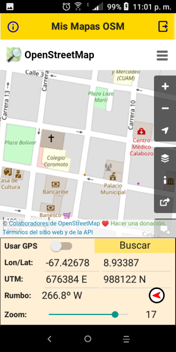
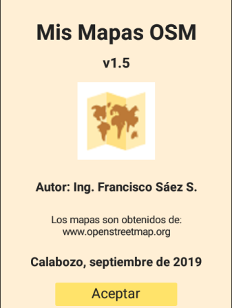

# Mapas OSM (Open Street Map)

---
## Descripción
App Android que muestra un mapa de OSM según la ubicación del GPS del móvil.

## Lenguaje/framework

* Lenguaje: Delphi 10.2 Tokyo. 
* Framework: Firemonkey. 

---

## Autor

Ing. Francisco José Sáez Soto.

e-mail: **fjsaez@gmail.com**

LinkedIn: **linkedin.com/in/francisco-josé-sáez-soto**

GitHub: **github.com/fjsaez**

---

Calabozo (Venezuela), septiembre de 2019.

---

## Imágenes de la aplicación

### Icono

### Pantalla principal

### Pantalla acerca

